# 🚀 Employee Management GraphQL API

### COMP3133 – Full Stack Development

[](https://nodejs.org/)
[](https://mongodb.com/)
[](https://www.apollographql.com/)
[](https://cloudinary.com/)
[]()

Production-style GraphQL backend service for managing employees with authentication, filtering, and cloud-based image uploads.

---

# 📌 Overview

This project implements a secure Employee Management API with:

- 🔐 JWT Authentication
- 👤 User Signup & Login
- 🧑‍💼 Employee CRUD Operations
- 🔍 Filtering by Designation / Department
- ☁️ Cloudinary Image Upload
- 🗄 MongoDB Atlas Integration

---

# 🏗 System Architecture

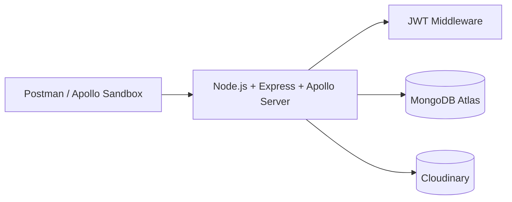

---

# 📂 Project Structure

```
COMP3133_STUDENTID_ASSIGNMENT1
│
├── src/
│   ├── config/
│   │   ├── cloudinary.js
│   │   └── db.js
│   │
│   ├── graphql/
│   │   ├── resolvers.js
│   │   └── typeDefs.js
│   │
│   ├── middleware/
│   │   └── auth.js
│   │
│   ├── models/
│   │   ├── Employee.js
│   │   └── User.js
│   │
│   ├── utils/
│   │   ├── cloudinaryUpload.js
│   │   └── errors.js
│   │
│   ├── validators/
│   │   ├── employeeValidators.js
│   │   └── userValidators.js
│   │
│   └── server.js
│
├── .env
├── .gitignore
├── package.json
├── package-lock.json
├── README.md
└── Screenshots.docx
```

---

# 🔐 Authentication

## 📝 Signup

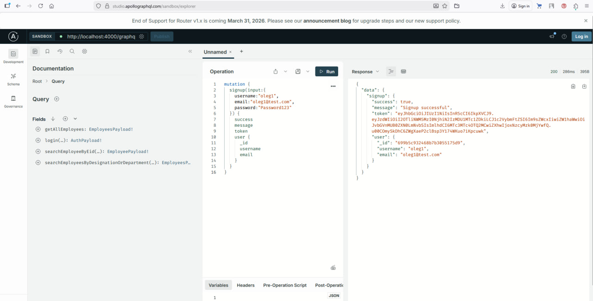

Additional Example:

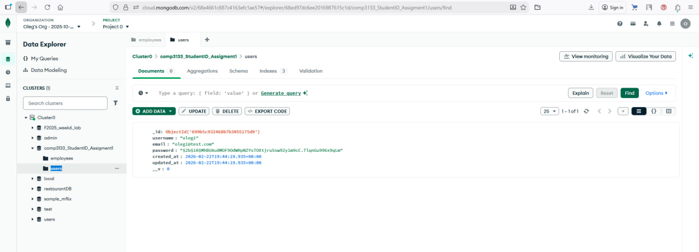

---

## 🔑 Login

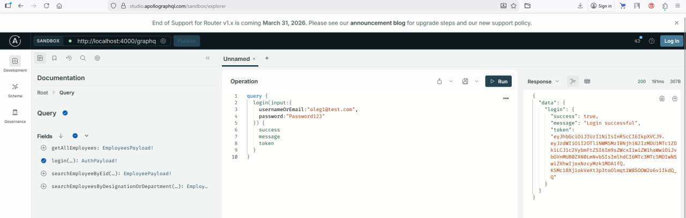

Token must be included in request headers:

```
Authorization: Bearer <JWT_TOKEN>
```

---

# 👤 Employee Operations

All employee operations require authentication.

---

## ➕ Create Employee

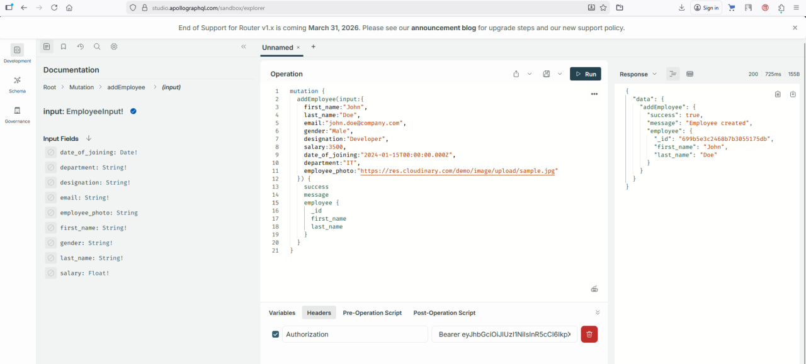

Additional Example:

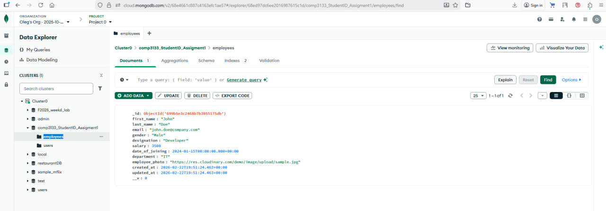

---

## 📋 Get All Employees

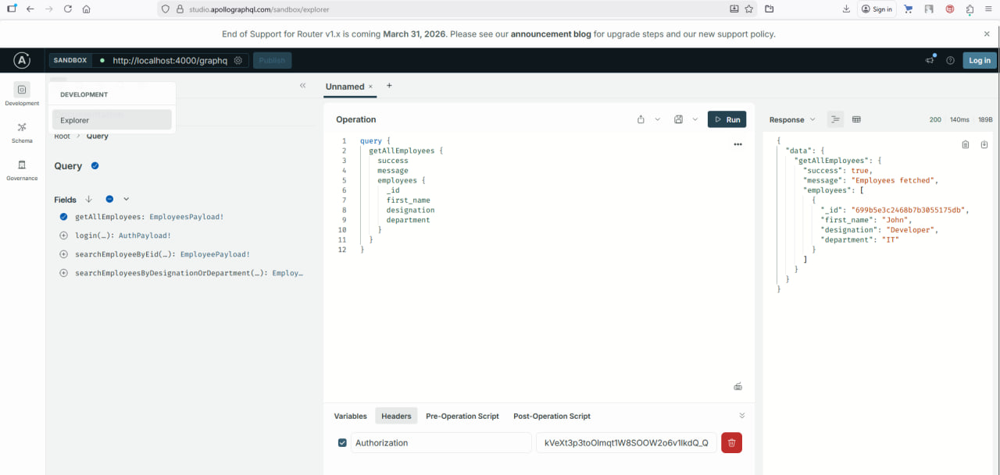

---

## 🔎 Get Employee By ID

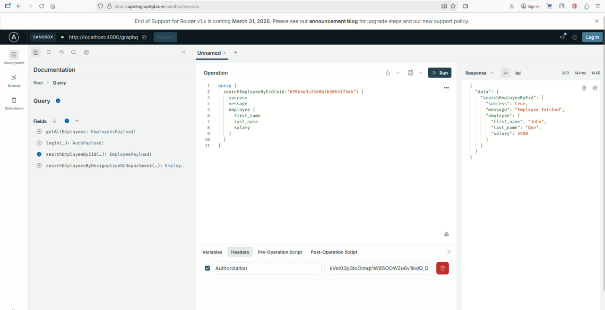

---

## 🎯 Search by Designation or Department

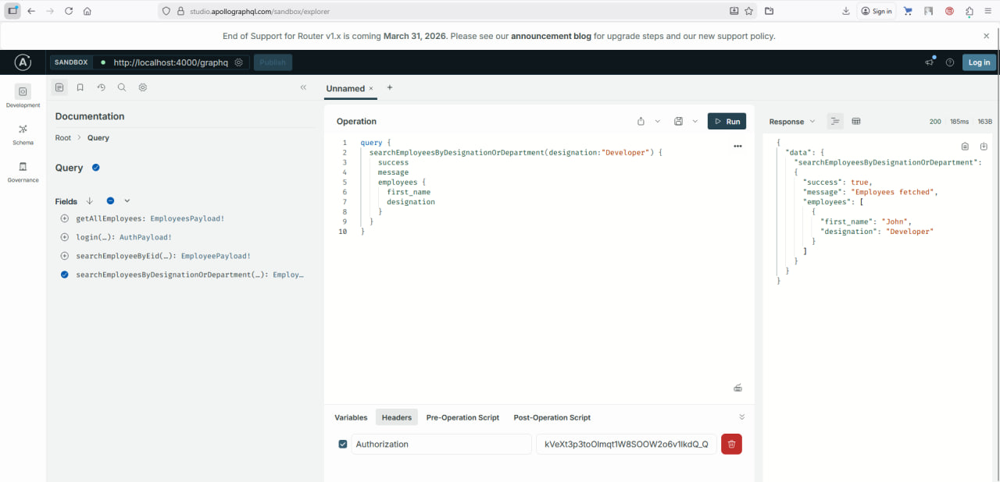

---

## ✏️ Update Employee

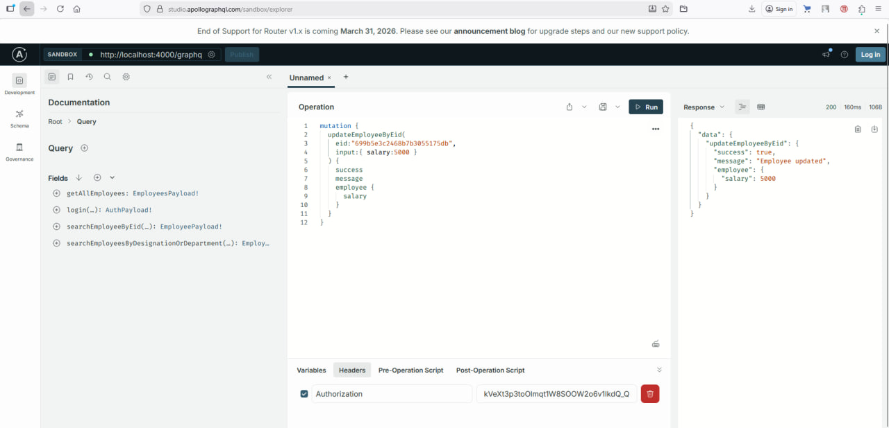

---

## ❌ Delete Employee

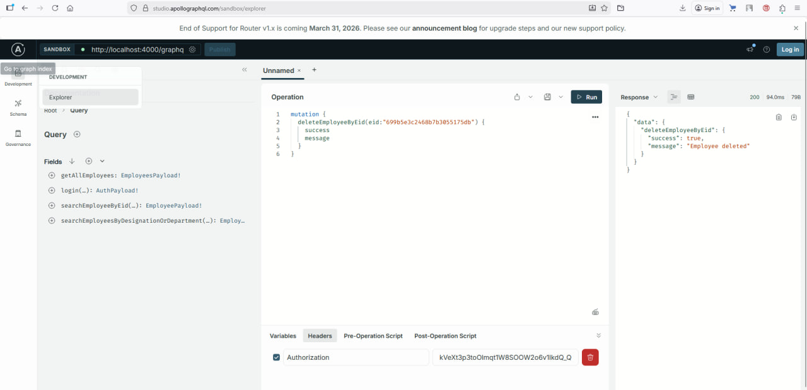

---

# ☁️ Cloudinary Integration

Uploaded employee images are securely stored in Cloudinary.


---

# 🗄 Database Models

## User Model

```js
{
  username: String,
  email: String,
  password: String,
  created_at: Date,
  updated_at: Date
}
```

## Employee Model

```js
{
  first_name: String,
  last_name: String,
  email: String,
  gender: String,
  designation: String,
  department: String,
  salary: Number,
  date_of_joining: Date,
  employee_photo: String,
  created_at: Date,
  updated_at: Date
}
```

---

# ▶️ Installation

## 1️⃣ Install dependencies

```bash
npm install
```

## 2️⃣ Create `.env`

```env
PORT=4000
MONGO_URI=your_mongodb_connection_string
JWT_SECRET=your_secret_key
JWT_EXPIRES_IN=7d

CLOUDINARY_CLOUD_NAME=your_cloud_name
CLOUDINARY_API_KEY=your_api_key
CLOUDINARY_API_SECRET=your_api_secret
```

## 3️⃣ Start server

```bash
npm run dev
```

Server runs at:

```
http://localhost:4000/graphql
```

---

# 🔒 Security Features

- bcrypt password hashing
- JWT authentication
- Protected GraphQL resolvers
- Environment variable protection
- Cloud-based image storage

---

# 🚀 Features Summary

✔ Clean layered architecture
✔ Cloudinary integration
✔ MongoDB Atlas cloud database
✔ Secure JWT authentication
✔ Filtering & search functionality
✔ Production-style error handling

---

# 👨‍💻 Author

Oleg Sanitskii
COMP3133 – Full Stack Development
George Brown College
